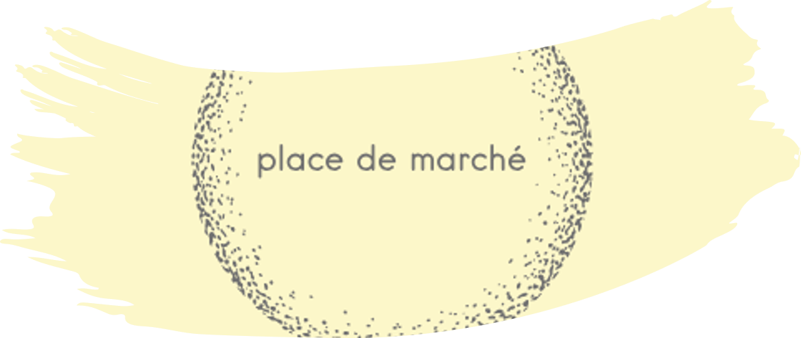

# CLASSIFIER AUTOMATIQUEMENT DES BIENS DE CONSOMMATION

Projet realisé en mai 2025 dans le cadre de ma formation Data Scientist avec CentraleSupélec/OpenClassrooms.

## Objectif du projet

L’entreprise "Place de marché”, qui souhaite lancer une marketplace e-commerce.Sur cette place de marché anglophone, des vendeurs proposent des articles à des acheteurs en postant une photo et une description. Pour l'instant, l'attribution de la catégorie d'un article est effectuée manuellement par les vendeurs, et est donc peu fiable. De plus, le volume des articles est pour l’instant très petit. Pour rendre l’expérience utilisateur des vendeurs (faciliter la mise en ligne de nouveaux articles) et des acheteurs (faciliter la recherche de produits) la plus fluide possible, et dans l'optique d'un passage à l'échelle,  il devient nécessaire d'automatiser cette tâche d'attribution de la catégorie. Il s'agira donc dans un premier temps d'étudier la faisabilité d'un moteur de classification des articles en différentes catégories, à partir du texte (en anglais) et de l’image de chaque article, puis de réaliser une classification supervisée à partir des images seules, ou à partir des images et du texte si les résultats le justifient. Enfin, il s'agira d'etudier la faisabilité de l'enrichissement de la base de produits vendus sur le site à partir de la collecte de données avec l'API du site openfoodfacts.org.
 

## Liste des fichiers

Les données-source sont disponibles en téléchargement direct sur https://s3-eu-west-1.amazonaws.com/static.oc-static.com/prod/courses/files/Parcours_data_scientist/Projet+-+Textimage+DAS+V2/Dataset+projet+pre%CC%81traitement+textes+images.zip

La documentation de l'API openfoodfacts.org est disponible sur https://openfoodfacts.github.io/openfoodfacts-server/api/how-to-download-images/.

* **fichiers :**
  - **notebook_1.ipynb :** code Python permettant l'import du fichier .csv, son nettoyage, l'analyse exploratoire & l'étude de faisabilité de la classification automatique des biens de consommation à partir du texte
  - **notebook_2.ipynb :** code Python permettant l'import des fichiers .png & l'étude de faisabilité de la classification automatique des biens de consommation à partir des images
  - **notebook_3.ipynb :** code Python permettant la classification automatique des biens de consommation à partir des images seules ou adjointes au texte
  - **notebook_4.ipynb :** code Python permettant la collecte de données avec l'API du site openfoodfacts.org
  - **scraping_sample.csv :** example de données collectées via l'API du site openfoodfacts.org
  - **slideshow.pdf :** diapositives de présentation du projet
 

## Compétences développées

 * Définir la stratégie d’élaboration d’un modèle d'apprentissage profond
 * Évaluer la performance des modèles d’apprentissage profond
 * Prétraiter des données non structurées de type image
 * Prétraiter des données non structurées de type texte
 * Réaliser la collecte des données répondant à des critères définis via une API
 * Réduire la dimension de données de grande dimension
 * Utiliser des techniques appropriées de réduction en deux dimensions

## Langages & software

 * Python 3.9.13

Voir requirements.txt pour la liste complète des librairies & packages.
  

## MENTIONS LEGALES

Certaines analyses dans cette étude ont été produites par CelineBoutinon sur la base des données en libre-accès sur https://world.openfoodfacts.org/. Open Food Facts  ne donne aucune garantie quant à l’exactitude, l’exhaustivité ou l’adéquation à l’usage des données et ne sauraient être tenu responsable de toute utilisation ou dépendance à l’égard de ces données, ni des analyses ou conclusions qui en découlent. Open Food Facts n’endosse ni ne certifie aucune analyse, interprétation ou conclusion présentée ici, qui restent la responsabilité seule de l'auteure. Pour plus de détails, veuillez consulter les conditions d’utilisation sur https://world.openfoodfacts.org/code-of-conduct.
